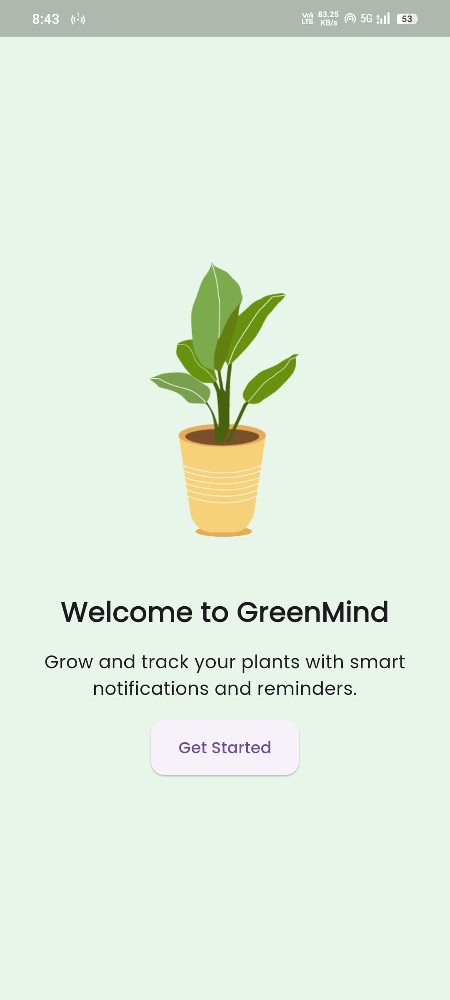
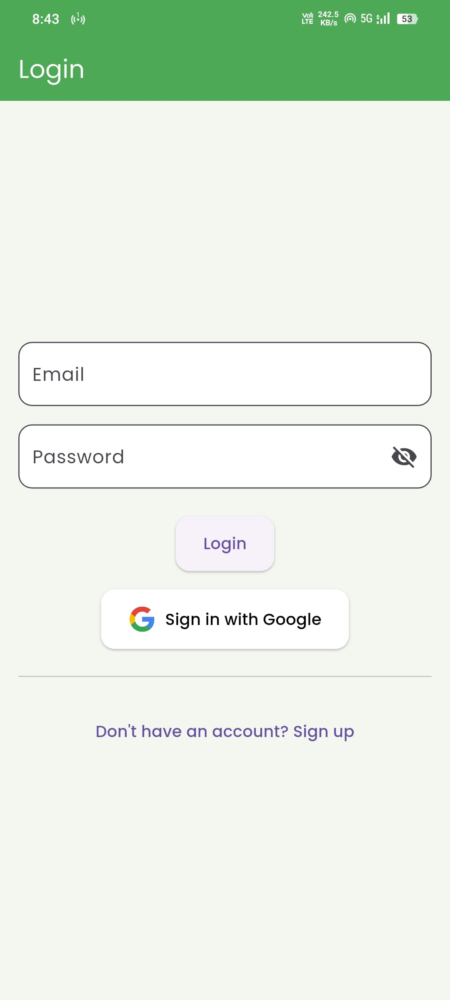
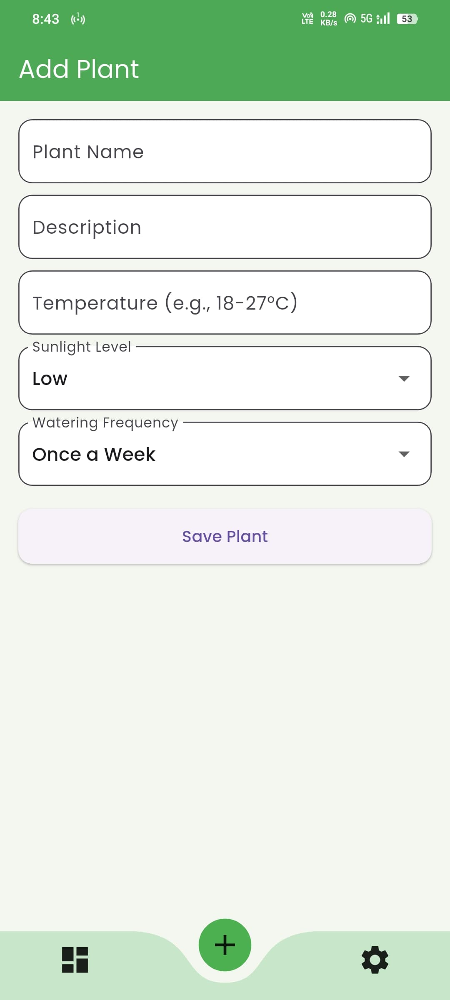
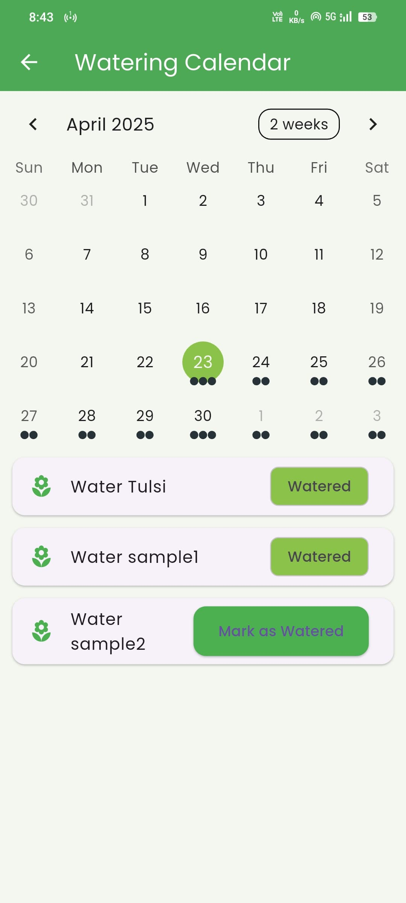
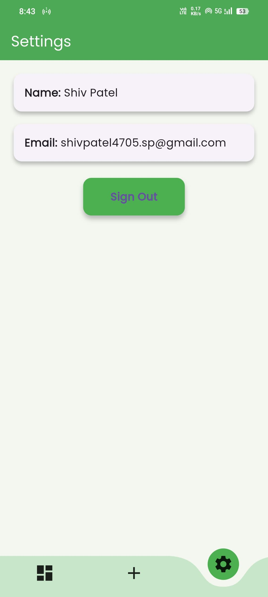

# 🌿 GreenMind - Plant Care Reminder App

**GreenMind** is a Flutter mobile application designed to help users manage their plant collection, track watering schedules, and ensure their plants stay healthy and happy. The app integrates Firebase for user authentication and Firestore for real-time plant data management.

---

## 📱 Features

- 🔐 **Authentication** – Email/Password login & Google Sign-In
- 🌱 **Plant Management** – Add, edit, delete and view your plants
- ⏰ **Smart Watering Reminders** – Based on watering frequency (e.g., every day, once a week)
- 📅 **Calendar View** – See upcoming and past watering events
- ✅ **Mark as Watered** – Track daily watering for each plant
- 📊 **Filters** – Filter plants by sunlight and water needs
- ⚙️ **Settings Screen** – Logout and user settings
- 💚 **Beautiful UI** – Curved navigation, Hero animations, Lottie animations (planned), and more

---

## 🛠 Tech Stack

- **Frontend**: Flutter
- **Backend**: Firebase Authentication & Firestore
- **Notifications**: Flutter Local Notifications
- **Calendar**: TableCalendar
- **State Management**: Stateful Widgets (can be upgraded to Provider/Bloc)

---

## 📸 Screenshots

| Starting Screen | Login Page | Home Page |
|-------------|-----------|----------|
|  |  |  |

| Add Plant Page | Calendar Page | Settings Page |
|-------------|-----------|----------|
|  |  |  |

---

## 🚀 Getting Started

### Prerequisites

- Flutter SDK
- Firebase Project (configured with Authentication & Firestore)
- Android/iOS device or emulator

### Setup

```bash
git clone https://github.com/yourusername/greenmind.git
cd greenmind
flutter pub get
